# 🍏 **MacOS-Style Dark Menu Bar for Windows** 🖥️

> Transform your Windows desktop with a sleek, MacOS-inspired dark menu bar!

---

## 📋 **Overview**

This AutoIt script creates a beautiful, functional dark menu bar at the top of your Windows screen that mimics the look and feel of macOS. It provides quick access to system functions, window management, and productivity tools while maintaining a professional dark theme aesthetic.


___


## 📜  Menu Features

___


## 📌 Main Bar


___


## 🌹 Full Desktop View


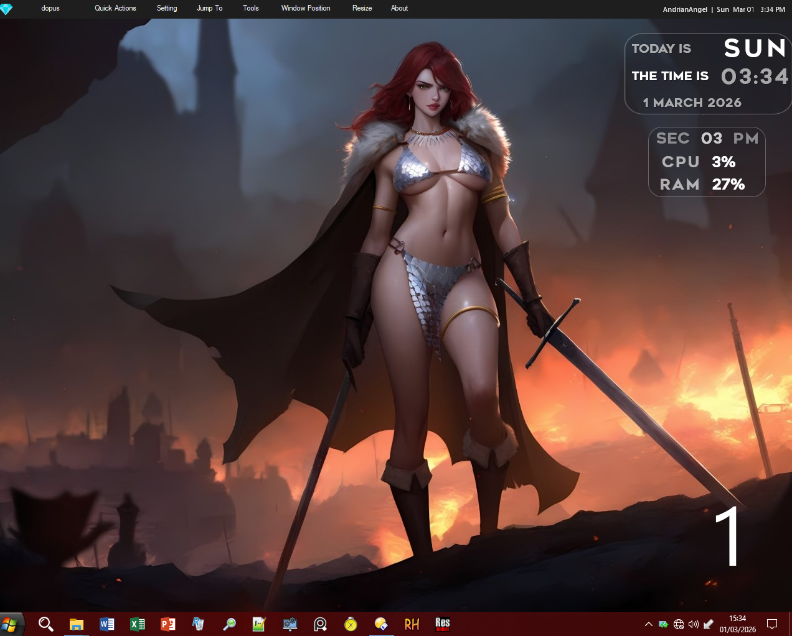


___


## 📣 Tray Menu


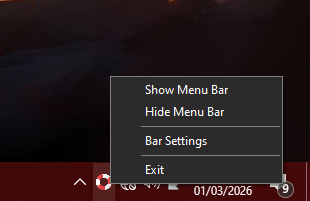


___


## ⚙️ Bar Setting


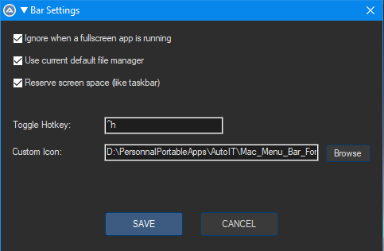


___


## ☘️ First Menu: With last active app's name


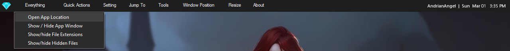

___


##  ☘️ Second Menu: Quick Actions


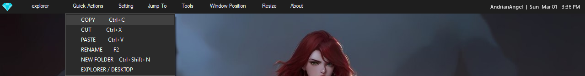

___


##  ☘️ Third Menu: Setting


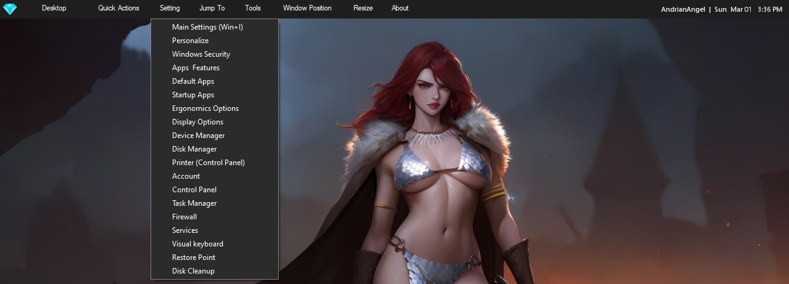

___


## 🌿 Fourth Menu: Jump To


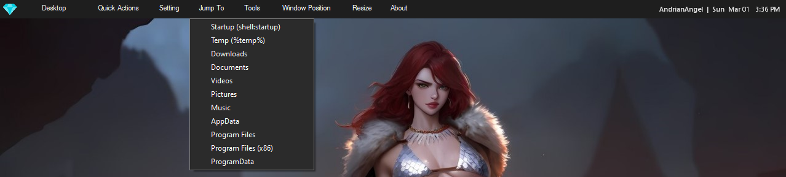

___


## 🌿 Fifth Menu: Tools


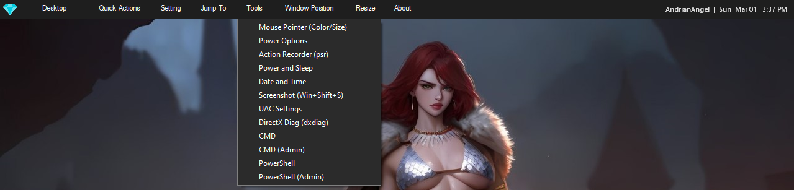

___


## 🌿 Sixth Menu: Window Position


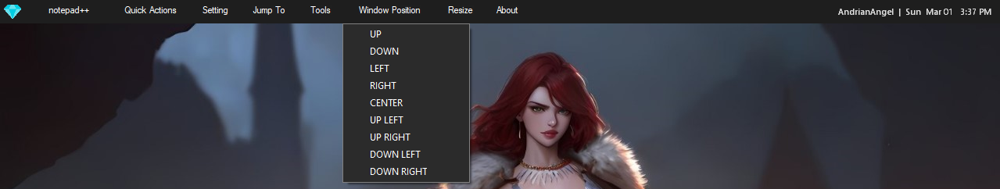

___


## 🌳Seventh Menu: Resize (Window)


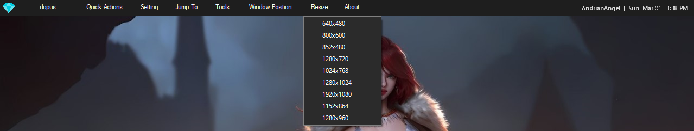

___


## 🌳Last Menu: About


___


## ✨ **Features**

### 🎯 **Core Functionality**
- **Persistent Top Bar** - Stays visible above all windows
- **Dark Theme** - Eye-friendly dark colors throughout
- **Active App Tracking** - Shows current application name
- **System Clock** - Displays time with day/date
- **Username Display** - Shows current user

### 📂 **Quick Access Menus**

| Menu | Features |
|:-----|:---------|
| **🍎 App Name** | Open app location, Show/hide window, Toggle file extensions, Toggle hidden files |
| **⚡ Quick Actions** | Copy, Cut, Paste, Rename, New Folder, My Computer |
| **⚙️ Setting** | Windows Settings shortcuts (Display, Personalization, Security, etc.) |
| **📍 Jump To** | Quick navigation to common folders (Downloads, Documents, etc.) |
| **🛠️ Tools** | System utilities (CMD, PowerShell, Screenshot, Disk Cleanup, etc.) |
| **📐 Window Position** | Snap windows to screen edges/center |
| **📏 Resize** | Preset window sizes (640x480 to 1920x1080) |
| **ℹ️ About** | Windows version info |

---

## 🎯 **Menu Items**

| Item | Action |
|:-----|:-------|
| **Settings** | Opens Windows Settings |
| **Control Panel** | Launches classic Control Panel |
| **Uninstall Apps** | Opens Apps & Features |
| **Default Apps** | Manages default applications |
| **WinVer** | Shows Windows version |
| **All Apps** | Simulates Windows key press |
| **Everything** | Launches Everything search (configurable path) |
| **CMD** | Command Prompt (Shift+Click for admin) |
| **Display** | Opens Display Settings |
| **Device Manager** | Launches Device Manager |
| **Calculator** | Opens Windows Calculator |
| **Task Manager** | Launches Task Manager |

---

## ⚙️ **Settings Options**

| Setting | Description |
|:--------|:------------|
| **Ignore fullscreen apps** | Auto-hide bar when apps go fullscreen |
| **Use default file manager** | Open folders with your preferred file manager |
| **Reserve screen space** | Bar behaves like a taskbar (prevents windows from overlapping) |
| **Toggle Hotkey** | Customize the settings hotkey (e.g., `!m` for Alt+M) |
| **Custom Icon** | Choose your own icon file |

___

 ## 📽️ Quick Demo


___

## 🚀 **Installation**

### **Method 1: Direct Download**
1. Download the appropriate zip file for your system:
   - `Mac_Menu_Bar_For_Windows_Stable_x64.zip` (64-bit)
   - `Mac_Menu_Bar_For_Windows_Stable_x86.zip` (32-bit)
2. Extract all files to a folder (e.g., `C:\Programs\MacMenuBar`)
3. Run `Mac_Menu_Bar_For_Windows_Stable_x64.exe` or `Mac_Menu_Bar_For_Windows_Stable_x86.exe`

### **Method 2: From Source**
1. Download `Mac_Menu_Bar_For_Windows_Stable.au3`
2. Download `Additional Libraries .zip` and extract to the same folder
3. Download `icons.zip` and extract to create an `icons` folder
4. Run with AutoIt3 interpreter or compile your own EXE

### **Required Files Structure**
```
YourFolder/
├── Mac_Menu_Bar_For_Windows_Stable.au3
├── _WinAPI_DPI.au3
├── GuiFlatButton_menu.au3
├── icons/
│   ├── mac.ico
│   └── a1.ico
└── settings.ini (created automatically)
```

---

## 🔧 **Usage Tips**

### **Auto-Start with Windows**
Create a shortcut in the startup folder:
1. Press `Win + R`, type `shell:startup` and press Enter
2. Right-click → New → Shortcut
3. Browse to the EXE file and complete the wizard

### **Keyboard Shortcuts in Menus**
- **Quick Actions**: Standard Windows shortcuts work (Ctrl+C, Ctrl+V, etc.)
- **Screenshot**: Available under Tools menu (Win+Shift+S)

### **Window Management**
- Position windows with one click to any screen edge
- Resize to common resolutions instantly
- Toggle app visibility from the App Name menu


---

## 🎯 **System Requirements**

- **OS**: Windows 7/8/10/11 (32 or 64-bit)
- **Memory**: ~10-15 MB RAM
- **Disk Space**: ~2 MB
- **Dependencies**: None (standalone executable available)

---

## 📜 **License**

**Copyright © 2026 AndrianAngel**

- ✅ **Open-source** for learning and personal use
- ❌ **Non-commercial use only**
- ✨ Please credit the original author when sharing or modifying

---

## 🐛 **Known Issues & Limitations**

- May conflict with some applications that modify the Windows work area
- Fullscreen detection might not work with all games/applications
- Settings dialog requires app restart to apply some changes

---

## 🆘 **Troubleshooting**

### **Bar doesn't appear?**
- Check if it's running (look for tray icon)
- Try restarting the application
- Check if hotkey is conflicting with another app

### **White background around icon?**
- This is normal during startup; it should disappear after a moment
- If persistent, restart the application

### **Menus appear with light background?**
- Ensure Windows is set to use dark mode
- The script attempts to force dark menus, but some Windows versions may override

---

## 🔄 **Updates & Support**

- **GitHub**: [AndrianAngel/MacMenuBar](https://github.com/AndrianAngel)
- For issues, suggestions, or contributions, please visit the GitHub repository

---

## 🙏 **Acknowledgments**

- AutoIt community for the amazing scripting language
- Windows API documentation providers
- All testers who provided feedback

___

##  ✅ULTIMATE EDITION COMES WITH BUG FIXES

___

## 📜 ULTIMATE EDITION FEATURES
___

## ⚙️ GENERAL (Ultimate)

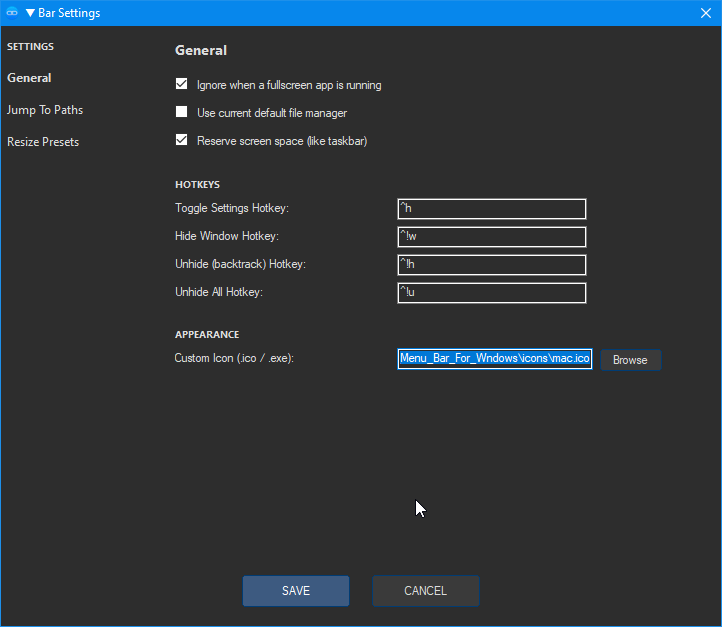

___

## 📌 JUMP TO PATHS (Ultimate)

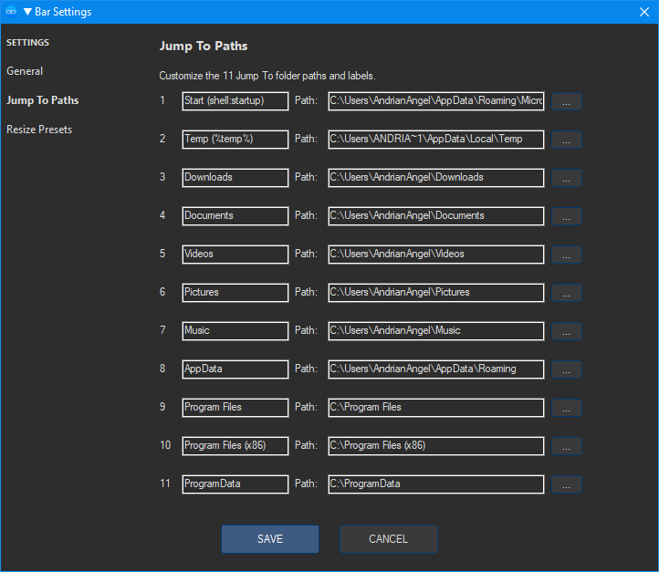

___

## 🌿RESIZE PRESETS (Ultimate)

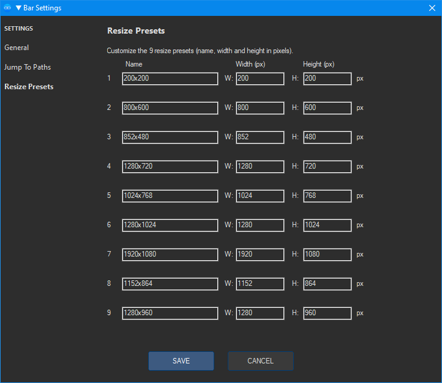

___

## ☘️TRAY MENU (Ultimate)

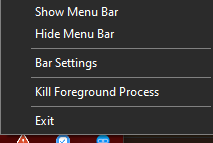

___

# 🍎 Mac Menu Bar For Windows — Ultimate Edition
### Changelog vs. Stable Version

---

## 🐛 Bugs Fixed

### 🪟 Hide / Unhide Problem
- **Stable:** "Show / Hide App Window" was a single toggle with no memory — hiding a window and then trying to unhide it had no reliable stack, and duplicate entries could corrupt the state.
- **Fixed:** Full LIFO hidden-window stack (`$aHiddenStack[100]`) with duplicate-check on push and automatic pruning of stale handles (`_PruneHiddenStack`). Hide/unhide is now reliable and stateful.

### 🖱️ Click Outside to Dismiss Bug
- **Stable:** Clicking outside an open menu didn't always dismiss it cleanly because focus wasn't transferred to the bar before tracking started.
- **Fixed:** Before `TrackPopupMenu`, focus is explicitly given to the bar window so Windows properly detects the outside-click and collapses the menu. Focus is then restored to the last active window after the menu closes.

### 🔴 Exit & Kill Process Bugs
- **Stable:** Only a plain "Exit" tray item existed. Hard crashes or hung processes had no recovery path, and exit cleanup could silently hang.
- **Fixed:**
  - Added **"Kill Foreground Process"** tray item (`_TrayKillProcess`) to instantly terminate the active foreground app.
  - Exit now spawns a **3-second watchdog** — if cleanup hangs, the process is force-killed by PID automatically.

### 🎯 Focus Problem on Unhide
- **Stable:** Unhiding a window via the menu didn't restore focus to that window, leaving the user without an active foreground app.
- **Fixed:** `_UnhideOneWindow` calls `WinActivate` after `WinSetState(@SW_SHOW)`, restoring focus to the re-shown window. Hotkey-triggered unhide works **entirely without needing prior focus** — it uses the AutoIt hotkey system directly.

---

## ✨ New Features

### 🙈 Hide / Unhide System (Complete Rework)
A full window-hiding engine has been built from scratch:

| Action | Hotkey (default) | Description |
|---|---|---|
| Hide active window | `Ctrl+Alt+W` | Hides foreground window & pushes to stack |
| Unhide (backtrack) | `Ctrl+Alt+H` | Pops and restores the most recently hidden window (LIFO) |
| Unhide All | `Ctrl+Alt+U` | Restores every hidden window at once |

- All three hotkeys are **fully customizable** in Bar Settings.
- Unhide operations work **regardless of which window has focus** — no need to click the bar first.
- Stack safely ignores the menu bar itself and the settings dialog.
- Menu entries **"Hide Window"**, **"Unhide (backtrack)"**, and **"Unhide All"** added to the App Name dropdown menu.

### 🗂️ 11 Fully Customizable Jump To Paths
- **Stable:** 11 hardcoded paths (Downloads, Documents, Temp, etc.) with no way to change them.
- **Ultimate:** All 11 paths **and their labels** are editable directly in Bar Settings → *Jump To Paths* tab. Browse buttons included for each entry.

### 📐 9 Fully Customizable Resize Presets
- **Stable:** 9 hardcoded resize presets (640×480, 1280×720, etc.) with fixed names.
- **Ultimate:** Every preset's **name, width, and height** are editable in Bar Settings → *Resize Presets* tab. Name them whatever you want — the Resize menu updates live on save.

### 🧭 Settings Dialog — 3-Tab Layout
Bar Settings now has a full tabbed interface:
- **General** — bar behavior, hotkeys (including the 3 new hide/unhide hotkeys), icon path, DPI, font, etc.
- **Jump To Paths** — edit all 11 folder shortcuts
- **Resize Presets** — edit all 9 resize entries (name + W×H)

### ☠️ Kill Foreground Process (Tray)
New tray menu item: **"Kill Foreground Process"** — instantly terminates whatever app is in the foreground. Useful for hanging or frozen windows without opening Task Manager.

### 🛡️ Exit Watchdog
Exit routine now spawns a background watchdog process. If the main process doesn't exit cleanly within ~3 seconds, the watchdog force-kills it by PID — no more ghost processes.

---

*Ultimate Edition — AndrianAngel © March 2026*

---

<p align="center">
  <i>Enjoy your Mac-style menu bar on Windows! 🎉</i>
</p>
